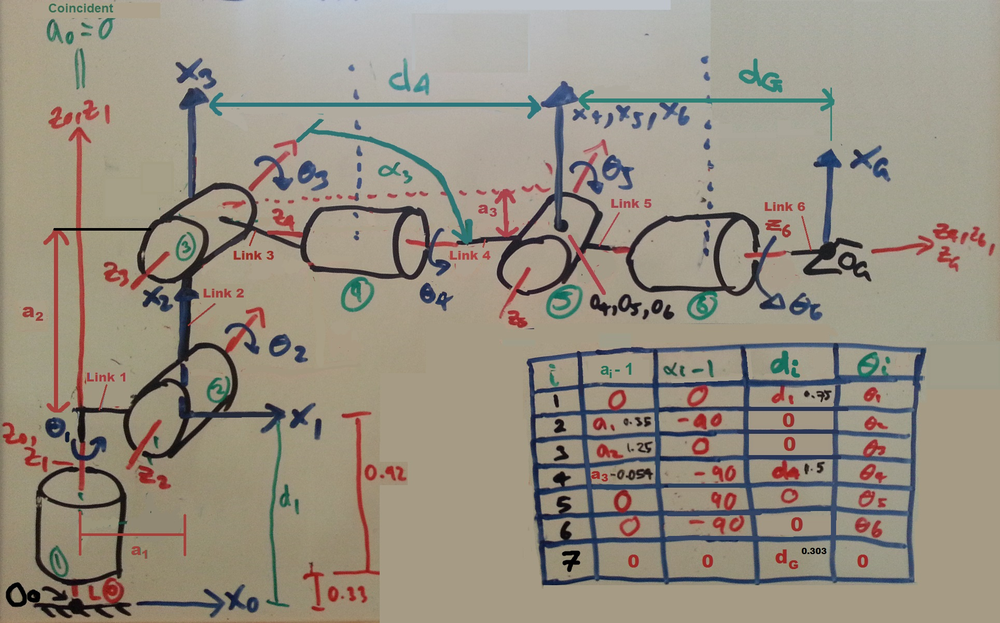
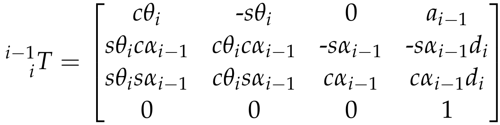
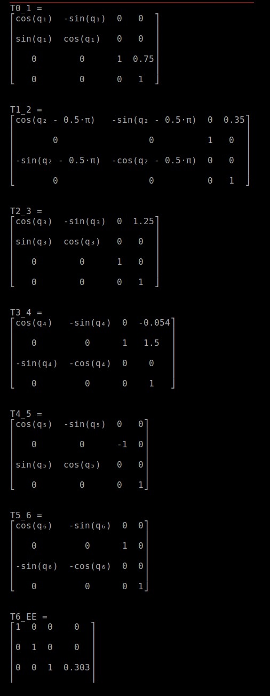
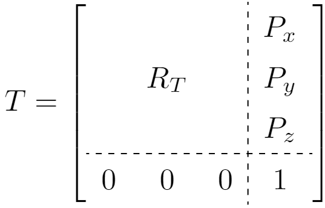
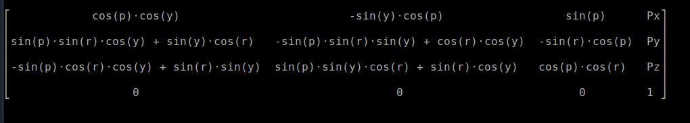

# Project: Pick and Place

**The goals / steps of this project are the following:**  

## 1. Demo and Denavit Hartenberg Parameters 

*Run the forward_kinematics demo and evaluate the kr210.urdf.xacro file to perform kinematic analysis of Kuka KR210 robot and derive its DH parameters.*

Below is the DH diagram and table derived for the KukaKR210 arm:


The table was derived as follows:

**Row 1**

* a0 is 0, due to z0 and z1 being coincident
* alpha0 is 0 as there is no skew angle between the z axis of joints 0 and 1
* d1 is the link offset measured from x0 to x1 and is found from the urdf file
* theta1 is the first joint variable

**Row 2**

* a1 is equal to 0.35m and measures the distance from z1 to z2, which is the horizontal distance along link 1 given by the urdf
* alpha1 is equal to minus 90 degrees, due to the rotation of z1 to z2
* As there is no offset between x1 and x2, d2 is zero
* theta2 is the second joint variable

**Row 3**

* a2 is again given by the urdf as 1.25m and is the distance from z1 and z2 along x2
* alpha2 is zero as there is no angle between the z axes of j2 and j3 as measured about x2
* d3 is zero as there is no offset between x2 and x3
* theta3 is the third joint variable

**Row 4**

* a3 is the (negative) small vertical offset from z3 to z4/5/6 as given by the urdf of 0.054m (5.4cm)
* alpha3 is minus 90 degrees, measuring from z3 to z4 in a right hand sense about x3
* As x axes of joints 4,5 and 6 are coincident for the wrist center, d4 is measured from x3 to the 'new' x4 and is given in the urdf as 1.5m.
* theta4 is the fourth joint variable

**Row 5**

* a4 is zero as z4 and z5 are coincident
* alpha4 is POSITIVE 90 degrees, being rotated in a right hand sense about x4
* d5 is zero as there is no offset between x4 and x5
* theta5 is the fifth joint variable

**Row 6**

* a5 is zero as z5 is coincident with z6
* alpha6 is again negative 90 degrees, measuring from z5 to z6 about x5
* d6 is zero as x6 is coincident with x5
* theta6 is the sixth joint variable

**Row 7**

* a7 is zero as z6 and zG are coincident
* alpha7 is zero as there is no rotation from J6 to the end effector  about x6
* dG is 0.303m given by the urdf and is the distance from x6 and the end effector.
* theta7 is zero as the end effector is not a revolute joint.


## Creating Matrices

*Using the DH parameter table you derived earlier, create individual transformation matrices about each joint. In addition, also generate a generalized homogeneous transform between base_link and gripper_link using only end-effector(gripper) pose.*

**Standard Homogenous Transformation matrix from frame i-1 to frame i using DH Parameters:**



The above standard homogeneous transform from frame i-1 to frame i is constructed as a sequence of four basic transformations, 
two rotations and two translations.

Into this standard equation are repeatedly substituted the parameters calculated in the DH Table, which yields the following 
matrices for one frame to the next. Note that for T6_EE, we see the *Identity Matrix* for the rotation portion of the transform,
given that there is no rotation from frame 6 to the frame of the end effector. There is however an offset of 0.303m which is 
included as a translation element.

**Individual Homogeneous Transformation Matrices**



It us also possible to create a homogeneous transformation matrix that represents only the transformation from the base link to
the end effector, in terms of the known end effector pose. It is represented concetually as follows:



It is expressed symbolically as follows, where r, p and y are the values of roll, pitch and yaw from the simulator:

**HTM from base to gripper only**



and where Px, Py and Pz are the world coordinates of the origin of the end effector. The rotation matrix is formed by mutliplying together the three elemental rotations about x, y and z axes.

## 2. Inverse Position and Inverse Orientation Calculations

*Decouple Inverse Kinematics problem into Inverse Position Kinematics and inverse Orientation Kinematics; doing so derive the equations to calculate all individual joint angles.*

[image6]: ../images/law-of-cosines.png
[image7]: ../images/cosine.png
[image8]: ../images/theta1.gif
[image9]: ../images/theta2.gif
[image10]: ../images/theta3.gif
[image11]: ../images/sidebcode.png
[image12]: ../images/sideb.gif
[image13]: ../images/theta1.png
[image14]: ../images/theta3diag.png
[image15]: ../images/theta2.png
[image16]: ../images/theta3.png
[image19]: ../images/image-4.png

### Inverse Orientation - Finding angles theta1, theta2 and theta3:

**For the inverse orientation step, we need to find the location of the wrist centre so that we can establish the 'inverse position'.**

![no text][image7]

Using the handwritten expressions above in terms of known wrist centre position, we can substitute in the below equation to find side b:
    
![no text][image12]

Which can be expressed in python as:

![no text][image11]

Next we can find the individual angles A, B and C using:


![no text][image6]
*                         source: http://www.onlinemathlearning.com/image-files/law-of-cosines.png*
        
And rearranging to find the angles. Using geometric information from the above hand drawn diagram, we can say that:

![no text][image8]

and:

![no text][image9]

Which can be expressed in python as:
    
![no text][image13]

and

![no text][image15]

Finally we can find theta3 considering the following diagram, and recalling that there is a small offset angle from joint 3 to joint 4:

![no text][image14]

Giving:
    
![no text][image10]

Which can be reppresented in code as:
    
![no text][image16]

This provides us with our three angles which set the location of the wrist centre equal to the position given by:
    
![no text][image19]

Where EE is the end effector and R is the horizontal distance along the z axis from joint5 to the end effector of 0.303 given by the urdf.
    


### Finding angles theta 4, theta5 and theta6

**For the next step, we need to find theta 4, 5 and 6 to establish the inverse orientation of the gripper.**


[image17]: ../images/symbolic_matrix.png
[image18]: ../images/theta456.png
[image19]: ../images/rinvr.png
[image20]: ../images/elements.png
[image21]: ../images/theta4.gif
[image22]: ../images/theta5.gif
[image23]: ../images/theta6.gif
    
This is achieved by finding a set of euler angles corresponding to the following:

![no text][image19]
    
We can find expressions for each of the angles by looking at the following matrix. This is the symbolic matrix created by multiplying just the rotation matrices from T3_4, T4_5 and T5_6 together and which represents the rotation from the origin of joint 3 to the origin of joint 6. 

![no text][image17]

We can consider this matrix in terms of its elements:
    
![no text][image20]

And as a result derive expressions for each of the angles:

![no text][image21]
![no text][image22]
![no text][image23]
    
Note that some terms are negative in sign which ensures that atan2 calculates the correct quadrant for the angle.

These expressions can be written in python as follows:

![no text][image18]


## 3. The code

[image19]: ../images/image-4.png

*Fill in the IK_server.py file with properly commented python code for calculating Inverse Kinematics based on previously performed Kinematic Analysis. Your code must guide the robot to successfully complete 8/10 pick and place cycles.*

I found this project to be extremely challenging, and as a result the code for my completed project comes mainly from the provided walkthrough, with a few tweaks and changes. For an in-depth explanation of what each line is doing, please refer to the comments in the included IK_server script.

I realised that not all DH Parameters and Homogenous Transformations are necessary in the calculations of Inverse Position and Orientation, and so in the interests of reducing cycle time I commented out those sections not required by the code. If I had chosen to implement the "challenge" elements of the project I would have needed to include especially the elements finding the forward kinematics to allow me to compare between the values found by the Inverse Kinematic calculations.

I also changed the method for finding the inverse of R0_3 in the line "R3_6 = R0_3.T * ROT_EE". The classroom recommended using the LU decomposition, however I found that this lead to inaccurate positioning of the robot manipulator. Given that the transpose of an orthogonal matrix is equal to its inverse, I used the .T transpose method. I believe this was more accurate as the LU decomposition carries out calculations of its own, and could have introduced errors which may have been compounded by subsequent calculations. Transpose on the other hand simply changes the arrangement of the matrix.

I also decided to use the function definition of the transformation matrices given in the walktrhough as this was cleaner and solve time was reduced. I have however included the original "long form" symbolic matrices in comments for illustration.

Accuracy in my tests was extremely good with 98-100% success rate. The only occasional failure I saw occurred when a plan is generated that is extremely close to the shelf retrieving the sample from position 3. The end effector would "try" to precisely match the plan at an inopportune moment, leading to a rotation of the sample that can sometimes lead to it hitting the shelf as it turns. However this is very rare in my testing and the end effector is nonetheless sticking to the plan. One way to possibly prevent it may have been to grip the samnple in the middle rather than at the top.

In order to improve calculation speed I could have perhaps experimented with using numpy rather than sympy, however I felt that the speed of the calculation stage of the pick and place cycle was not too onerous.

Note that the line:

    WC = EE - (0.303) * ROT_EE[:,2]

Represents the wrist centre position given by the following: 

![no text][image19]

Where d is the distance along the z axis given by the urdf file of 0.303m from the end effector to the wrist centre.


```python

```
